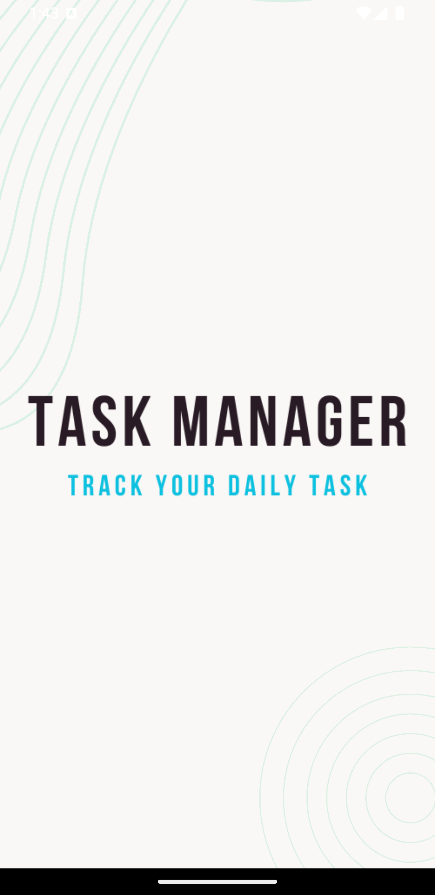
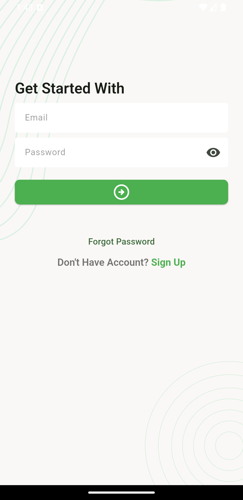
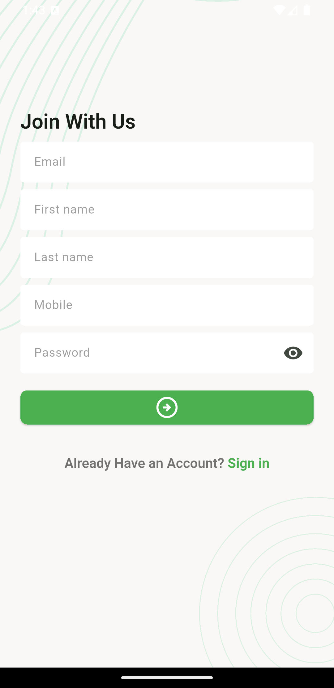
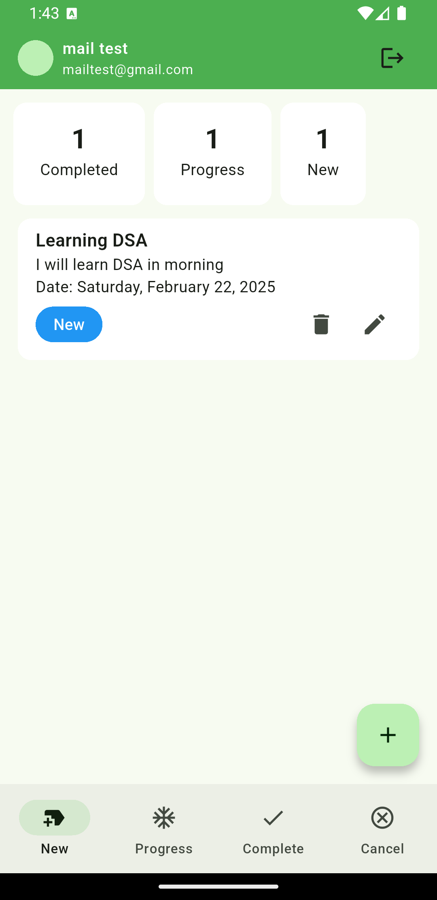
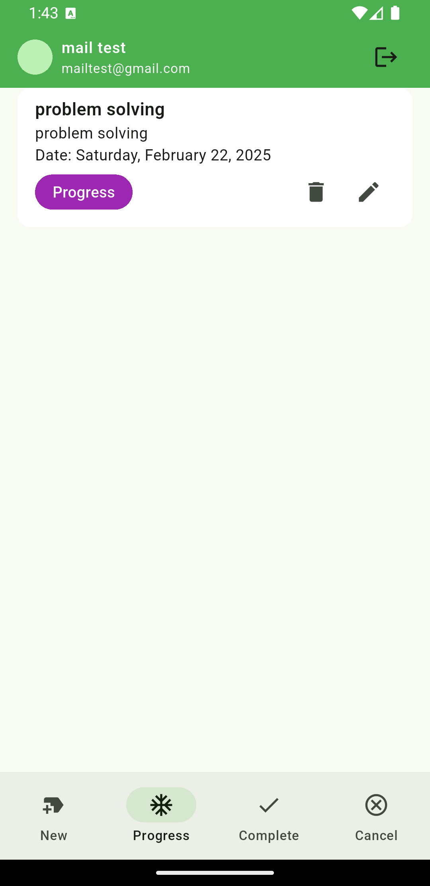
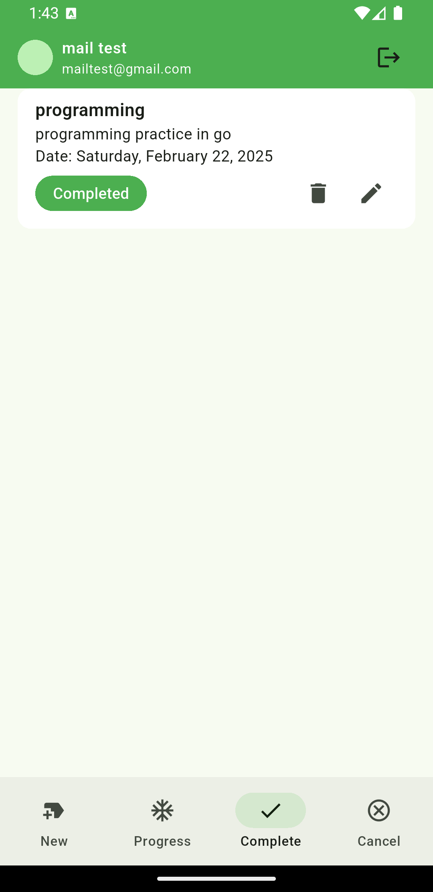

# 📝 Task Manager App

A simple and efficient mobile application to manage daily tasks. Built with Flutter, this app allows users to add, update, delete, and track tasks through multiple status levels like: New, In Progress, Completed, and Cancelled.

---

## 📱 Features

- ✅ User Authentication (Login & Signup)  
- 🗂️ Add, Update, and Delete Tasks  
- 🔄 Task Status Management (New, In Progress, Completed, Cancelled)  
- 🔒 Secure API Communication  
- 🌙 Beautiful and responsive UI  
- ☁️ Backend integration via REST API  

---

## 📸 Screenshots

| Splash Screen | Login Screen | Register Screen |
|---------------|--------------|-----------------|
|  |  |  |

| New Task | In Progress | Completed |
|----------|-------------|-----------|
|  |  |  |

---

## 🧰 Technologies Used

- Flutter (UI)  
- Dart (Logic)  
- REST API (Backend integration)  
- Getx (State management)  

---

## 🚀 Getting Started

### Prerequisites

- Flutter SDK  
- Android Studio / VS Code  
- Emulator or physical device  

### Installation

```bash
git clone https://github.com/jihanurrahman33/task-manager.git
cd task-manager
flutter pub get
flutter run


⸻

⚙️ API Endpoints (Sample)
	•	POST /api/login
	•	POST /api/signup
	•	GET /api/tasks
	•	POST /api/tasks
	•	PUT /api/tasks/:id
	•	DELETE /api/tasks/:id

Make sure to update the baseUrl in your service layer.

⸻

📂 Folder Structure

lib/
│
├── models/         # Task and user models
├── screens/        # All UI screens (Login, Signup, Home, etc.)
├── services/       # API service calls
├── widgets/        # Reusable UI components
└── main.dart       # Entry point


⸻

🤝 Contribution

Pull requests are welcome. For major changes, please open an issue first.

⸻

📄 License

This project is licensed under the MIT License - see the LICENSE file for details.
